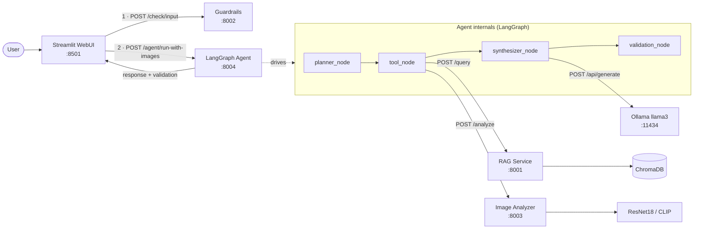

<div align="center">

# AI Property Triage System

**Autonomous real-estate intake, retrieval, vision analysis, validation, and orchestration platform powered by local AI models.**


</div>

<div align="center">

> _Local-first, microservice-based AI command center for triaging property listings end-to-end —_
> _from raw description and photos to a triaged recommendation, validated and explained._

</div>

<div align="center">


_System architecture — full diagram in [docs/architecture-diagram.md](docs/architecture-diagram.md)._

</div>

<div align="center">


_End-to-end demo of the autonomous triage pipeline._

</div>

---

## Overview

Real-estate agencies receive listing submissions in highly variable quality — text and photos arrive together, often with missing details, irrelevant images, or over-confident marketing language. Manual triage is slow, inconsistent, and doesn't scale.

**The AI Property Triage System automates the first 90% of that intake work** while keeping a human in the loop for everything that matters. A user (or an upstream system via n8n) submits a description and photos. From there, an autonomous LangGraph agent decides which tools to call, retrieves comparable listings, classifies room types and condition from the images, and produces a validated brief: a summary, a recommended route, concrete actions, renovation insights, and a confidence score.

**What makes it different:**

- **Fully local AI stack.** Ollama llama3 for reasoning, ChromaDB for vector retrieval, a custom-trained PyTorch ResNet18 for vision. No OpenAI, no cloud inference, no data leaving the box.
- **Autonomous agent, not a hard-coded pipeline.** The agent's LangGraph state machine plans tool calls dynamically per request and tells the truth about what actually contributed.
- **Two-sided guardrails.** Rule-based input filtering blocks junk before it hits the LLM; output validation flags hallucinated features, risky language, and non-real-estate images.
- **Real moderation, not theatre.** The vision model is trained on a `not_real_estate` class. If you upload a selfie or a cat, the listing is blocked at the gate.
- **Production-shaped surface.** Four FastAPI microservices, a Streamlit operations dashboard, n8n webhook flows, and a documented prompt-engineering log.

---

## Highlights

| | |
|---|---|
| 🧠 | **Autonomous agent** built on LangGraph (`planner → tool → synthesizer → validation`). |
| 🔎 | **Retrieval-Augmented Generation** over a synthetic listings corpus indexed in ChromaDB. |
| 🖼️ | **Custom-trained PyTorch ResNet18** for room classification; CLIP zero-shot as a safety fallback. |
| 🛡️ | **Input + output guardrails** including AI-driven image moderation. |
| 💬 | **Conversational assistant** grounded in the most recent triage. |
| ⚙️ | **n8n workflows** exposing the agent over public webhooks with optional prefiltering. |
| 🎨 | **Deloitte-inspired dark dashboard UI** built in Streamlit. |
| 📊 | **88.39% test accuracy** on the in-house real-estate room classifier. |

---

## Architecture

The system is split into four FastAPI microservices, a Streamlit web UI, and an n8n workflow runner. Everything runs locally; the diagram below shows the main path; full breakdown is in [docs/architecture-diagram.md](docs/architecture-diagram.md).



### Services at a glance

| Service | Path | Role |
|---|---|---|
| **Guardrails Service** | [`services/guardrails-service/`](services/guardrails-service/) | Rule-based input validation (length, spam, real-estate vocabulary). |
| **LangGraph Agent Service** | [`services/langgraph-agent-service/`](services/langgraph-agent-service/) | Autonomous orchestrator. Decides which tools to call; runs llama3 for synthesis; enforces output guardrails. |
| **RAG Service** | [`services/rag-service/`](services/rag-service/) | Semantic search over the listings corpus via ChromaDB + sentence-transformers. Type-filtered queries with graceful unfiltered fallback. |
| **Image Analyzer Service** | [`services/image-analyser-service/`](services/image-analyser-service/) | Trained ResNet18 (primary) with CLIP zero-shot fallback. Emits per-image room class, condition score, confidence, and moderation flags. |
| **Streamlit WebUI** | [`webui/`](webui/) | Operations dashboard: listing intake, results, validation, dataset browser, conversational assistant. |
| **n8n Workflows** | [`n8n/`](n8n/) | Webhook-driven external entry points with optional input prefiltering. See [n8n/README.md](n8n/README.md). |

---

## Features

| Capability | Status | Notes |
|---|---|---|
| Autonomous LangGraph agent orchestration | ✅ | `planner → tool → synthesizer → validation` graph |
| Retrieval-Augmented Generation | ✅ | ChromaDB + sentence-transformers `all-MiniLM-L6-v2` |
| Property-type-aware RAG filtering | ✅ | Office queries return offices, not "modern apartments" |
| Custom-trained PyTorch image classifier | ✅ | ResNet18 transfer learning, 88.39% test accuracy |
| CLIP zero-shot fallback | ✅ | Engaged when the trained checkpoint is missing or fails |
| AI image moderation (`not_real_estate`) | ✅ | Blocks submission for suspicious uploads above threshold |
| Input guardrails | ✅ | Rule-based: empty / too short / spam / off-topic |
| Output validation layer | ✅ | Unsupported claims, risky language, confidence scoring |
| Conversational assistant | ✅ | Local llama3 grounded in the last triage |
| Dataset browser & "Analyse this listing" | ✅ | Browse the synthetic corpus and run the pipeline in one click |
| n8n webhook orchestration | ✅ | Three implemented flows: text, multipart, prefiltered |
| Enterprise dark dashboard UI | ✅ | Custom CSS, glow accents, confidence meters |
| Docker Compose deployment | 🚧 | Planned |
| Cloud / EC2 deployment | 🚧 | Planned |
| Persistent chat memory | 🚧 | Planned |
| PDF report export | 🚧 | Planned |

---

## AI / ML Stack

| Component | Purpose | Detail |
|---|---|---|
| **LangGraph** | Agent orchestration | Typed `StateGraph` with four nodes. Tool calls, fallback paths, validation all expressed as graph edges. |
| **Ollama (llama3)** | Local LLM inference | JSON-mode synthesis in the agent; free-form chat in the assistant tab. No API keys. |
| **sentence-transformers** | RAG embeddings | `all-MiniLM-L6-v2`. Same model used by populate script and query path so vectors are comparable. |
| **ChromaDB** | Vector store | Persistent on-disk collection. Metadata filtering on `property_type`. |
| **ResNet18 (PyTorch)** | Trained room classifier | Transfer learning: ImageNet backbone frozen, custom head trained on the project's real-estate dataset. |
| **CLIP** | Zero-shot fallback | `openai/clip-vit-base-patch32` with natural-language prompts. Always loaded; engaged when the trained checkpoint is missing or inference fails. |
| **Custom validators** | Output guardrails | Deterministic, no second LLM call. Detects unsupported claims, risky phrasing, and computes confidence level. |
| **Image moderation** | Input safety | `not_real_estate` class trained directly into the vision model; threshold of 0.75 blocks listings with a UI moderation card. |

### Model performance

The vision classifier started as CLIP zero-shot. To improve precision on domain images, a custom ResNet18 head was trained via transfer learning on the project's real-estate dataset.

| Metric | Value |
|---|---|
| **Train accuracy** | **88.02%** |
| **Test accuracy** | **88.39%** |
| Architecture | ResNet18, frozen backbone + new FC head |
| Training | 8 epochs, Adam (lr=1e-3), CrossEntropy, ImageNet normalization |
| Classes | bathroom, bedroom, balcony, building_exterior, kitchen_dining, living_room, garden, not_real_estate |
| Fallback | CLIP zero-shot, automatic if checkpoint missing |

Training script: [`services/image-analyser-service/train_classifier.py`](services/image-analyser-service/train_classifier.py)

---

## Screenshots

> Placeholder section — drop screenshots into `docs/screenshots/` with the filenames below.

| | |
|---|---|
| **Main dashboard** |  |
| **RAG analysis** |  |
| **Image analysis** |  |
| **Moderation block** |  |
| **Conversational assistant** |  |
| **Dataset browser** |  |
| **n8n workflows** |  |

---

## How It Works

```
[ User / external system ]
            │
            ▼
   1. Input guardrails (rule-based)
            │ pass
            ▼
   2. LangGraph planner decides which tools to call
            │
            ├──► 3. RAG retrieval (ChromaDB)
            │
            └──► 4. Vision analysis (ResNet18 → CLIP fallback)
            │
            ▼
   5. Synthesizer (Ollama llama3, JSON mode)
            │
            ▼
   6. Output validation layer
            │
            ▼
   7. Result rendered + chat assistant grounded on it
```

1. **User submits a listing** — description, agent name, optional photos.
2. **Input guardrails** check length, spam, off-topic. Rejections return immediately with a reason.
3. **Autonomous agent planner** decides which tools to invoke based on what the caller already provided.
4. **RAG retrieves comparable listings** from ChromaDB, with property-type metadata filtering.
5. **Vision AI analyses uploaded images** — ResNet18 for room type + condition; CLIP fallback if needed; moderation flag for `not_real_estate`.
6. **Validation layer** scans the LLM output for unsupported feature claims and risky language, then computes a confidence level and a publication status.
7. **Conversational assistant** (also local llama3) is now grounded in this triage — suggested follow-ups appear automatically.

---

## Running Locally

### Prerequisites

| Requirement | Version |
|---|---|
| Python | 3.11+ |
| pip | 23+ |
| Ollama | latest ([download](https://ollama.com)) |
| OS | Windows 11, macOS, or Linux |
| RAM | 8 GB minimum, 16 GB recommended (CLIP + ResNet + llama3 in memory) |

### 1. Clone the repository

```bash
git clone <your-fork-or-this-repo>.git
cd ai-property-triage-system
```

### 2. Install per-service dependencies

Each service has its own `requirements.txt`. Use a single virtualenv or one per service — your call.

```bash
python -m venv .venv
source .venv/bin/activate              # macOS / Linux
# .venv\Scripts\Activate.ps1           # Windows PowerShell

pip install -r webui/requirements.txt
pip install -r services/guardrails-service/requirements.txt
pip install -r services/rag-service/requirements.txt
pip install -r services/image-analyser-service/requirements.txt
pip install -r services/langgraph-agent-service/requirements.txt
```

### 3. Start Ollama and pull llama3

```bash
ollama serve            # in its own terminal
ollama pull llama3      # one-time download (~4.7 GB)
```

### 4. Populate the RAG vector store (one-time)

```bash
python services/rag-service/populate_chroma.py
```

This embeds the 22 synthetic listings into a local ChromaDB collection under `services/rag-service/chroma_db/`.

### 5. _(Optional)_ Train the image classifier

If you have a labelled image dataset at `data/image-dataset/training_dataset_v4_train_test/`:

```bash
python services/image-analyser-service/train_classifier.py
```

Skip this step and the service will automatically use the CLIP zero-shot fallback — moderation will be less strict.

### 6. Start the four FastAPI services

Each in its own terminal (Windows PowerShell shown; use `python -m` if `uvicorn` isn't on `PATH`):

```bash
cd services/rag-service              && uvicorn main:app --reload --port 8001
cd services/guardrails-service       && uvicorn main:app --reload --port 8002
cd services/image-analyser-service   && uvicorn main:app --reload --port 8003
cd services/langgraph-agent-service  && uvicorn main:app --reload --port 8004
```

### 7. Launch the Streamlit dashboard

```bash
streamlit run webui/app.py
```

Open <http://localhost:8501>.

### 8. _(Optional)_ Start n8n

```bash
npx n8n        # or `n8n start` if installed globally
```

Open <http://localhost:5678> and import / build the workflows documented in [n8n/README.md](n8n/README.md).

---

## Service Ports

| Service | Port | Purpose |
|---|---|---|
| RAG | `8001` | Semantic listing retrieval |
| Guardrails | `8002` | Rule-based input validation |
| Image Analyzer | `8003` | Room classification + condition + moderation |
| Agent | `8004` | LangGraph orchestrator |
| Streamlit | `8501` | Operations dashboard |
| n8n | `5678` | Workflow runner / webhooks |
| Ollama | `11434` | Local LLM |

---

## n8n Workflows

Three implemented and tested webhook flows expose the agent to external systems. Full setup in [n8n/README.md](n8n/README.md).

| Flow | Endpoint | Description |
|---|---|---|
| **01 · agent-webhook** | `POST /webhook/agent-webhook` | Text-only intake. Forwards to the agent; agent fetches RAG internally. |
| **02 · agent-webhook-with-images** | `POST /webhook/agent-webhook-with-images` | Multipart intake with property photos. Triggers full vision + RAG + synthesis. |
| **03 · guardrails-prefilter** | `POST /webhook/guardrails-prefilter` | Cheap rule-based gate in front of the agent. Rejects bad input before the LLM ever runs. |

---

## Dataset

| Asset | Location | Description |
|---|---|---|
| Synthetic listings | [`data/synthetic-listings/listings.json`](data/synthetic-listings/listings.json) | 22 fictional residential and commercial listings (apartment, house, villa, office, retail, industrial). Powers the RAG corpus and the dataset browser. |
| Image dataset | `data/image-dataset/training_dataset_v4_train_test/` | Real-estate room photos in eight classes used to train the ResNet18 classifier. Not committed to git — provided locally. |

**Room classes used by the trained model:**
`bathroom`, `bedroom`, `balcony`, `building_exterior`, `kitchen_dining`, `living_room`, `garden`, `not_real_estate`.

The `not_real_estate` class is the moderation channel — when a non-property image is uploaded with confidence ≥ 0.75, the agent blocks publication and the WebUI renders a red moderation card with a CTA to remove the flagged image.

---

## Project Structure

```
ai-property-triage-system/
├── webui/
│   ├── app.py                              # Streamlit dashboard (single-file UI)
│   └── requirements.txt
├── services/
│   ├── guardrails-service/                 # Rule-based input filter
│   ├── rag-service/
│   │   ├── main.py                         # FastAPI semantic search
│   │   ├── populate_chroma.py              # One-time index builder
│   │   └── chroma_db/                      # Persistent vector store (gitignored)
│   ├── image-analyser-service/
│   │   ├── main.py                         # ResNet18 + CLIP fallback + moderation
│   │   ├── train_classifier.py             # Transfer-learning trainer
│   │   └── models/                         # Trained checkpoints (.pth gitignored)
│   └── langgraph-agent-service/
│       └── main.py                         # LangGraph StateGraph + Ollama synthesis
├── n8n/
│   └── README.md                           # Three documented webhook flows
├── docs/
│   ├── architecture-diagram.md             # Mermaid system diagram
│   ├── architecture-notes.md               # Open questions and design notes
│   ├── prompt-engineering-log.md           # Iteration history
│   └── screenshots/                        # Placeholders for README screenshots
├── data/
│   ├── synthetic-listings/listings.json    # 22-entry RAG corpus
│   └── image-dataset/                      # Local training data (gitignored)
├── README.md
└── .gitignore
```

---

## Demo Walkthrough

### Example 1 — Happy path (residential)

**Input:**
> "Renovated 3-room apartment near the beach in Bat Yam. Balcony, parking, modern kitchen, sea view."

**What the system produces:**
- Route: **Residential** (green badge)
- Comparable listings: 3 nearby Bat Yam / coastal apartments from the corpus
- Image analysis: room type + condition + confidence per photo
- Validation: passed, confidence **High**
- Publication status: **Ready**

### Example 2 — Renovation flag

**Input:**
> "Old 3-room apartment in Nahariya that needs renovation. Functional kitchen, fair condition, balcony."

**What changes:**
- Renovation insight triggered by the description and matching corpus entries (`condition == "needs renovation" | "fair"`).
- Confidence drops to **Medium** unless images are also flagged.
- Recommendations include verifying scope of work with the listing agent.

### Example 3 — Moderation block (suspicious image)

**Input:** any valid description + an obviously non-real-estate image (selfie, cat, meme).

**What the system does:**
- Vision model classifies the upload as `not_real_estate` at high confidence.
- Validation overrides: `validation_passed=false`, `confidence_level=low`.
- Top-level: `submission_blocked=true`.
- WebUI renders the large red **"⚠ Suspicious image detected"** card with the CTA: _"Remove the flagged image and upload a valid property photo to continue."_
- Executive Summary shows **Publication status: BLOCKED**.
- Listing analysis remains visible — only publication approval is withheld.

### Sample assistant questions

After any successful triage, ask the assistant:
- "What are the main risks?"
- "What should the agent verify before publishing?"
- "Is this property attractive for investors?"
- "What should be renovated first?"

The assistant is grounded in the **most recent triage only**. Off-topic questions are politely rejected with: _"I can only assist with questions related to the analysed property."_

---

## Roadmap

Planned next steps in rough priority order:

- 🐳 **Docker Compose** — one-command spin-up of all four services + Ollama + n8n.
- ☁️ **EC2 / cloud deployment** — containerised services, GPU-backed Ollama, managed vector store.
- 🔐 **Authentication** — Basic/Header auth on the n8n webhooks; API keys on the agent endpoint.
- 🧠 **Persistent chat memory** — SQLite-backed conversation history across sessions, with retrieval over past triages.
- 🔍 **Hybrid retrieval** — dense (current) + BM25 sparse for keyword-sensitive queries (prices, street names).
- 📦 **Vector store scaling** — swap ChromaDB persistent file for an OpenSearch / Pinecone deployment.
- 📄 **PDF / DOCX export** — generate a printable triage report from the agent response.
- 🛡️ **NeMo Guardrails** — replace the hand-rolled input filter with a colang policy.
- 🤝 **Multi-agent specialisation** — split synthesis into residential / commercial / industrial sub-agents with domain prompts.
- 📈 **Evaluation harness** — labelled triage set, regression tests on agent and validator outputs.

---

## Documentation

- [Architecture diagram](docs/architecture-diagram.md) — full Mermaid diagrams + EC2 deployment table.
- [Prompt engineering log](docs/prompt-engineering-log.md) — iteration-by-iteration history of prompts, agent behaviour, and guardrails.
- [n8n workflows](n8n/README.md) — node-by-node setup for the three webhook flows.
- [Architecture notes](docs/architecture-notes.md) — open design questions and tradeoffs.

---

## License & Acknowledgements

Built as an AI Engineering capstone. Synthetic listings, image dataset, and trained checkpoints are research artifacts of this project. Visual design language was inspired by enterprise consulting dashboards — no third-party logos, trademarks, or branded assets are used.

Tech stack credits:
[Streamlit](https://streamlit.io) · [FastAPI](https://fastapi.tiangolo.com) · [LangGraph](https://langchain-ai.github.io/langgraph/) · [Ollama](https://ollama.com) · [PyTorch](https://pytorch.org) · [ChromaDB](https://www.trychroma.com) · [sentence-transformers](https://www.sbert.net) · [Transformers / CLIP](https://huggingface.co/openai/clip-vit-base-patch32) · [n8n](https://n8n.io)

<div align="center">

_Built end-to-end as a learning exercise. Every prompt, model, fallback, and validator is intentional — see the prompt engineering log for the full evolution._

</div>
