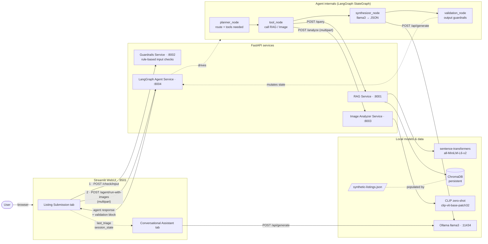
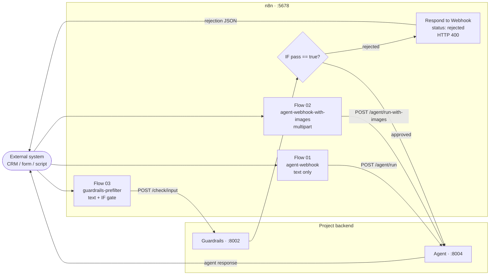

# Architecture Diagram

Visual reference for the implemented architecture of the AI Property Triage
System. Two diagrams: the **main WebUI flow** that the Streamlit interface
drives, and the **n8n flows** that expose the same backend to external
callers.

## Main WebUI flow

## n8n integration

All three flows below are implemented, published, and tested in n8n. See
[../n8n/README.md](../n8n/README.md) for node-by-node setup details and
test commands.

## Component reference

| Component | Port | Process | Role |
|-----------|------|---------|------|
| Streamlit WebUI | 8501 | local | Listing submission UI + Conversational Assistant tab; calls Guardrails then Agent. |
| Guardrails Service | 8002 | local FastAPI | Rule-based input validation (empty / too short / spam / off-topic). |
| LangGraph Agent Service | 8004 | local FastAPI | Autonomous orchestrator. StateGraph: planner → tool → synthesizer → validation. |
| RAG Service | 8001 | local FastAPI | Semantic search over the listings corpus; type-filtered queries with unfiltered fallback. |
| ChromaDB | n/a (file) | local | Persistent vector store at `services/rag-service/chroma_db`. |
| sentence-transformers | n/a (in-proc) | local | Embedding model `all-MiniLM-L6-v2` loaded by the RAG service. |
| Synthetic listings | n/a (file) | local | 22 fictional residential + commercial listings (`data/synthetic-listings/listings.json`). |
| Image Analyzer Service | 8003 | local FastAPI | CLIP zero-shot room classification + PIL-based condition score. |
| CLIP | n/a (in-proc) | local | `openai/clip-vit-base-patch32` loaded by the Image Analyzer. |
| Ollama (llama3) | 11434 | local | Local LLM used by the agent synthesizer and the chat tab. |
| Output Validation Layer | n/a (in-graph) | local | Deterministic guardrails on LLM output: unsupported claims, risky phrases, confidence level, recommendation sanitization. |
| n8n | 5678 | local | Workflow automation surface. Three implemented and tested flows. |

## What each component does

- **Streamlit WebUI** — two tabs. *Listing Submission* runs the pipeline (Guardrails then Agent). *Conversational Assistant* is grounded in the last triage stored in `st.session_state.last_triage` and chats with Ollama directly.
- **Guardrails Service** — fast rule-based checks (real-estate keyword presence, spam phrases, min length). Returns `{"pass": bool, "reason": str|null}`.
- **LangGraph Agent Service** — orchestrator. Receives description + optional images, decides which tools to call, runs Ollama for synthesis, validates output, returns one combined response.
- **RAG Service** — semantic search over the listings corpus. Detects property type from the query and adds a metadata `where` filter when it can, with an unfiltered fallback if the filter eliminates everything.
- **ChromaDB** — persistent vector store on disk. Repopulated by `services/rag-service/populate_chroma.py`.
- **sentence-transformers** — embedding model shared by both the populate script and the RAG service (same model on both sides so query vectors are comparable to stored vectors).
- **Image Analyzer Service** — accepts multipart image uploads. CLIP zero-shot picks a room type from `{kitchen, bathroom, bedroom, living_room, exterior, other}`; a PIL heuristic (brightness peakiness + contrast + edge sharpness) maps to a 1–5 condition score.
- **CLIP** — in-process vision-language model used for zero-shot classification.
- **Ollama (llama3)** — local LLM. Used by the agent's synthesizer for JSON-mode generation and by the chat tab for free-form Q&A.
- **Output Validation Layer** — a deterministic LangGraph node. Flags unsupported feature claims, risky/overconfident phrasing, computes `confidence_level ∈ {low, medium, high}`, and sanitizes recommendations when risky phrases appear.
- **n8n** — three flows: text-only webhook → Agent; multipart webhook → Agent (with images); guardrails-prefilter that short-circuits before the LLM if input fails the cheap checks.

## Implementation decisions

- **RAG** uses ChromaDB + sentence-transformers `all-MiniLM-L6-v2`. Corpus = 22 synthetic listings, loaded via `populate_chroma.py`. Queries are metadata-filtered by detected property type with a graceful fallback.
- **Image Analyzer** uses CLIP zero-shot classification (`openai/clip-vit-base-patch32`) with natural-language prompts. Condition score is a deterministic PIL heuristic, isolated for a later PyTorch swap.
- **Agent** uses LangGraph `StateGraph` (planner → tool → synthesizer → validation) with Ollama llama3 in the synthesizer node. Deterministic rule-based fallbacks produce the same response shape if Ollama is unreachable or returns invalid JSON.
- **Output Validation** is pure-rule, no second LLM call. Checks features against a curated vocabulary grounded in the inputs, detects a fixed list of risky phrases, sanitizes recommendations, and emits a confidence level.
- **Guardrails (input)** is a custom rule-based service for now. NeMo Guardrails / LLM-based checks are an explicit later upgrade.
- **n8n** has three implemented and tested flows: `agent-webhook`, `agent-webhook-with-images`, `guardrails-prefilter`.

## Local today vs EC2 later

Today everything runs on the developer machine. The split below shows what
stays local vs. what's expected to move when a cloud deployment lands.

| Concern | Today (local) | Planned EC2 / cloud |
|---------|---------------|---------------------|
| Streamlit WebUI | localhost:8501 | Streamlit on an EC2 instance behind ALB / CloudFront. |
| FastAPI services | uvicorn, four ports | Containers (one per service) on the same EC2 host or ECS task; internal-only networking. |
| ChromaDB | on-disk under the RAG service | Same on-disk pattern (EBS volume) or a managed vector store (Pinecone / OpenSearch). Interface stays the same. |
| Ollama llama3 | local CPU/GPU | EC2 GPU instance running Ollama, or a managed inference endpoint. |
| CLIP | in-process with the Image Analyzer | Same container; GPU instance recommended for batch image throughput. |
| sentence-transformers | in-process with the RAG service | Same container; CPU is fine for `all-MiniLM-L6-v2`. |
| n8n | localhost:5678 | n8n on its own small EC2 (or n8n Cloud); webhooks fronted by API Gateway. |
| Listings corpus | JSON file in the repo | S3 + a re-populate job; ChromaDB rebuilt as part of deploy. |
| Secrets / config | hardcoded URLs | SSM Parameter Store / Secrets Manager; service URLs from env vars. |

> No application code changes were made for this document. The diagrams
> describe the system as it is in this repo today — not a future-state
> target.
